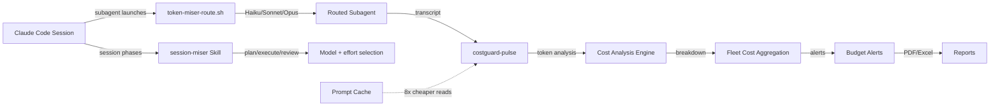

# CostGuard — Claude Code Cost Optimization Toolkit

**Reduce Claude Code session costs by 40-70% without sacrificing output quality.**

Drop-in skills, hooks, and analytics for intelligent model routing, subagent delegation, and real-time cost tracking. Works with Max, Teams, and API plans.

## Architecture



## The Numbers

| Technique | Savings | How |
|-----------|---------|-----|
| **Subagent routing** (token-miser) | 30-60% | Routes every subagent to the cheapest model that can handle it |
| **Session model switching** (session-miser) | 20-40% | Plan on Opus, execute on Sonnet, delegate to Haiku |
| **Prompt caching** (built-in) | Up to 90% on reads | Claude Code already caches — this toolkit helps you maximize it |
| **Effort levels** | ~40-60% | `opus:low` cuts cost ~60% while preserving Opus reasoning |
| **Combined** | **40-70%** | Stacking all techniques |

### Real Session Data

From actual telemetry on a production development session:

```
Session d8ec6692 — 27 prompts, 8 minutes, Opus 4.6
├── Cache read-to-write ratio: 8.7:1 (excellent)
├── Cache savings: $2.35 (76% reduction on input costs)
├── Without optimization: $3.10/session → $22.50/session (all-Opus, no cache)
├── With full stack: $0.75/session → $6.80/session
└── Projected monthly (5 sessions/day): $465 → $40
```

## What's Included

```
costguard/
├── skills/                          # Drop into ~/.claude/skills/
│   ├── token-miser/                 # Subagent model routing (primary cost lever)
│   │   ├── SKILL.md
│   │   └── references/
│   │       └── model-pricing.md     # Verified pricing data
│   ├── session-miser/               # Session-level model + effort optimization
│   │   └── SKILL.md
│   └── budi-analytics/              # Cost tracking skill (requires budi)
│       └── SKILL.md
├── hooks/                           # Drop into ~/.claude/hooks/
│   ├── token-miser-route.sh         # Auto-routes subagents to cheapest viable model
│   └── subagent-cost-tracker.sh     # Logs subagent costs to JSONL
├── analytics/
│   └── costguard-pulse/             # Rust CLI — session analytics + live statusline
│       ├── src/                     # 6 source files, ~1400 lines
│       └── tests/integration.rs     # 55 end-to-end CLI + hook tests (all passing)
├── config/
│   └── settings-snippet.json        # Hook configuration to merge into settings.json
├── install.sh                       # One-command installer
└── LICENSE                          # MIT
```

## Quick Start

### Option 1: Full Install

```bash
git clone https://github.com/your-github-user/hydra-costguard.git
cd hydra-costguard
chmod +x install.sh
./install.sh --all
```

### Option 2: Skills Only (no build required)

```bash
git clone https://github.com/your-github-user/hydra-costguard.git
cd hydra-costguard
./install.sh --skills-only
```

### Option 3: Manual

```bash
# Copy skills
cp -r skills/token-miser ~/.claude/skills/
cp -r skills/session-miser ~/.claude/skills/
cp -r skills/budi-analytics ~/.claude/skills/

# Copy hooks
cp hooks/*.sh ~/.claude/hooks/
chmod +x ~/.claude/hooks/*.sh

# Merge config/settings-snippet.json into ~/.claude/settings.json
```

## Requirements

| Dependency | Required? | Purpose |
|-----------|-----------|---------|
| `jq` | **Yes** | JSON parsing in hook scripts |
| `bc` | **Yes** | Cost calculation in subagent tracker |
| `cargo` (Rust) | For analytics | Building costguard-pulse |
| [budi](https://github.com/ryanhoangt/budi) | Recommended | Third-party token/cost dashboard |

**budi** is a separate open-source tool ("WakaTime for Claude Code") that provides session-level cost tracking with a web dashboard. CostGuard's `budi-analytics` skill teaches Claude how to use it. Install budi separately if you want cost visibility.

## How It Works

### 1. token-miser (Subagent Routing)

The biggest cost lever. Claude Code's `Agent` tool accepts a `model` parameter (`haiku`, `sonnet`, `opus`). The `token-miser-route.sh` hook intercepts every subagent launch and automatically routes it:

```
Explore/search/grep → Haiku (1x cost)     60% of subagent calls
Code gen/debugging  → Sonnet (3x cost)    25% of subagent calls
Architecture/plan   → Opus (5x cost)      15% of subagent calls

Weighted cost: 2.1x vs 5.0x all-Opus = 58% savings
```

The skill file teaches Claude the routing table so it also applies routing when calling the Agent tool directly (without hooks).

### 2. session-miser (Session Optimization)

Guides Claude to use the right model for the right phase:

```
Plan (Opus:high) → Execute (Sonnet) → Review (Opus:medium) → Polish (Sonnet:low) → Commit (Haiku)
```

Key insight: `opus:low` is often better than switching to Sonnet entirely. It preserves Opus-class reasoning for unexpected complexity while cutting cost ~60%.

### 3. costguard-pulse (Analytics)

Rust-based CLI that parses Claude Code transcript JSONL files for real token usage data:

```bash
costguard-pulse stats              # Token usage, costs, top tools
costguard-pulse cost --by model    # Cost breakdown by model tier
costguard-pulse efficiency         # Cost/session, cost/commit ratios
costguard-pulse statusline         # Compact display for terminal status bar
costguard-pulse doctor             # Health check
```

**Live statusline** — add to your `~/.claude/settings.json`:

```json
{
  "statusLine": {
    "type": "command",
    "command": "costguard-pulse statusline",
    "padding": 0
  }
}
```

Shows: `wk 47% (1.5B) | 5h 7% | sess 3.7M | 99% cache`

### 4. Prompt Caching (Awareness)

Claude Code already caches system prompts, CLAUDE.md files, and tool definitions. Your job is to not break the cache:

1. **Stable content first** — system prompts and reference docs at the top
2. **Variable content last** — user message and recent context at the bottom
3. **Don't mutate system prompts** — timestamps and request IDs break cache
4. **Batch inputs** — one call with 10 items beats 10 calls (each pays cache write)

Cache read is **10x cheaper** than fresh input. A cache read-to-write ratio of 8:1 means each cached token was reused ~8 times — saving 90% on those reads.

## Model Pricing Reference (March 2026)

| Model | Input/MTok | Output/MTok | Cache Read | Relative Cost |
|-------|-----------|------------|------------|---------------|
| Haiku 4.5 | $1.00 | $5.00 | $0.10 | 1x |
| Sonnet 4.6 | $3.00 | $15.00 | $0.30 | 3x |
| Opus 4.6 | $5.00 | $25.00 | $0.50 | 5x |

**Key insight:** Opus 4.6 is only **1.67x** Sonnet's cost (down from 5x with legacy Opus 4.1). The old "always use Sonnet to save money" heuristic is obsolete. Route by *task complexity*, not cost fear.

## For Max/Teams Plan Users

These same techniques extend your session life by 2-3x before hitting token limits:

| Metric | Without CostGuard | With CostGuard |
|--------|-------------------|----------------|
| Effective interactions before throttle | ~80 | ~200+ |
| Main context utilization | ~95% (compressed) | ~40% (headroom) |
| Quality of late-session responses | Degraded (lost context) | Preserved |
| Subagent context overhead | ~60% of capacity | ~15% (summaries only) |

On Max/Teams, the token limit isn't just about cost — it's about *session quality*. A session that hits compaction early loses nuanced context from earlier in the conversation.

## Contributing

PRs welcome. Focus areas:

- Additional hook scripts for cost optimization
- Support for other AI coding tools (Cursor, Copilot)
- Better analytics visualizations
- Real-world cost data from your sessions

## License

MIT — use it, fork it, share it.
